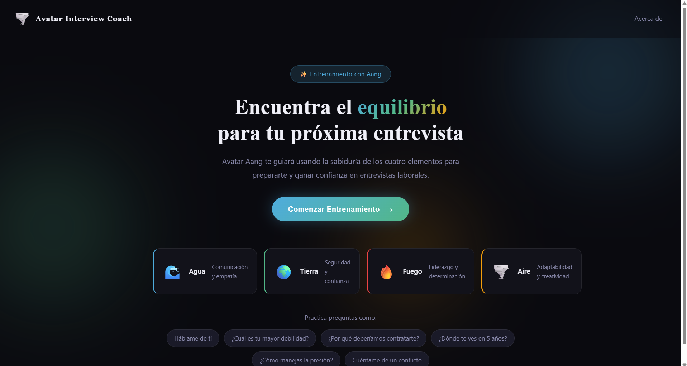
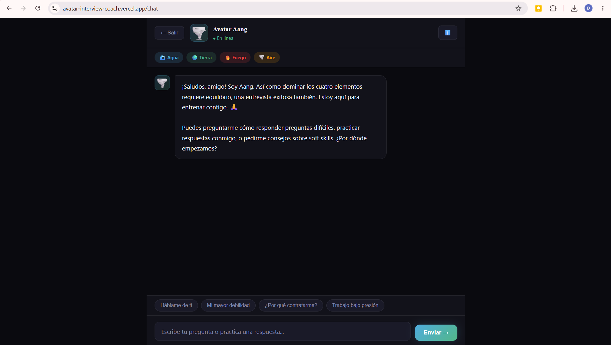

# Avatar Interview Coach

Proyecto Integrador 3 (PIM3 - Full Stack, Henry) — Single Page Application que permite chatear
con un personaje ficticio usando inteligencia artificial, con routing básico (History API) y
una función serverless en Vercel que protege la API key.

🔗 **App desplegada:** https://avatar-interview-coach.vercel.app

## Índice

- [Personaje elegido](#personaje-elegido-avatar-aang)
- [Funcionalidades](#funcionalidades)
- [Stack técnico](#stack-técnico)
- [Estructura del proyecto](#estructura-del-proyecto)
- [Requisitos](#requisitos)
- [Ejecutar en local](#ejecutar-en-local)
- [Cómo ejecutar los tests](#cómo-ejecutar-los-tests)
- [Cómo desplegar a Vercel](#cómo-desplegar-a-vercel)
- [Capturas de pantalla](#capturas-de-pantalla)
- [Registro del uso de IA](#registro-del-uso-de-ia-en-el-proyecto)

## Personaje elegido: Avatar Aang

El personaje es **Aang**, el Avatar y último maestro aire de la serie *Avatar: La Leyenda de
Aang*. En esta aplicación, Aang actúa como **entrenador de entrevistas laborales**: usa la
filosofía de los cuatro elementos (agua, tierra, fuego, aire) como metáforas de soft skills
(comunicación, confianza, liderazgo, adaptabilidad) para ayudar a la persona usuaria a
prepararse para una entrevista de trabajo.

- Tono cálido, sabio y con humor ligero, propio del personaje.
- Respuestas cortas y conversacionales, pensadas para chat (no ensayos largos).
- Mantiene el contexto de la conversación mientras dura la sesión.
- Definido mediante un system prompt propio en `api/chat.js` (personalidad, tono, límites,
  idioma), enviado en cada request junto con el historial de la conversación.

## Funcionalidades

**Vistas / routing (SPA con History API):**
- `/home` — bienvenida y presentación del personaje.
- `/chat` — conversación con Aang.
- `/about` — información del proyecto y del personaje.
- Navegación sin recargar la página, URLs que reflejan la vista actual, y botones back/forward
  del navegador funcionando correctamente (`popstate`).

**Chat:**
- Diferenciación visual entre mensajes del usuario y del personaje.
- Indicador animado de "escribiendo..." mientras la IA responde.
- Estado visual distinto para errores (color/borde diferenciado, no solo texto).
- Historial de conversación mantenido durante la sesión y enviado a la IA en cada request
  (para que el personaje mantenga contexto).
- Scroll automático al último mensaje. Enviar con el botón o con Enter.

**Diseño responsive (mobile-first):**
- Estilos base pensados para celular; se amplían con `min-width` en dos breakpoints
  (`481px` y `768px`) hacia tablet/desktop — sin mezclar `max-width`.

**Seguridad:**
- La API key de OpenRouter nunca se expone en el cliente: todas las llamadas a la IA pasan por
  la Vercel Serverless Function `api/chat.js`, que la lee desde variables de entorno.

## Stack técnico

- **Frontend:** HTML + CSS + JavaScript vanilla (sin frameworks), Vite como servidor de
  desarrollo y bundler.
- **Routing:** SPA con History API (`pushState` / `popstate`), sin recargas de página.
- **Backend:** Vercel Serverless Function (`api/chat.js`) que actúa como proxy seguro hacia
  la IA, para no exponer la API key en el cliente.
- **Proveedor de IA:** [OpenRouter](https://openrouter.ai) (modelo `openai/gpt-oss-20b:free`),
  usado en lugar de la API directa de Gemini para evitar fricciones de SDK/autenticación del
  lado del proveedor — decisión validada como aceptable para este PI.
- **Tests:** [Vitest](https://vitest.dev) + `jsdom` (para pruebas de DOM/routing) con `fetch`
  mockeado en los tests de la función serverless y del chat (sin llamadas de red reales).

## Estructura del proyecto

```
avatar-mentor/
├── api/
│   └── chat.js            # Serverless function: proxy seguro hacia OpenRouter
├── src/
│   ├── index.html
│   ├── app.js              # Routing SPA (History API) y wiring de eventos
│   ├── chat.js              # Lógica del chat (envío, render, estados)
│   ├── utils.js              # Funciones puras de transformación/validación de datos
│   └── styles.css             # Estilos mobile-first
├── tests/
│   ├── api.test.js         # Handler de api/chat.js, con fetch mockeado
│   ├── app.test.js         # Routing SPA con jsdom
│   ├── chat.test.js        # Envío de mensajes y estado de error, con fetch mockeado
│   └── utils.test.js       # Funciones puras de utils.js
├── docs/                   # Capturas de pantalla para este README
├── .env.example            # Variables necesarias, sin valores reales
├── vercel.json              # Rewrites para el routing SPA en producción
├── vite.config.js
└── package.json
```

## Requisitos

- Node.js 18 o superior (se usa `fetch` global, disponible desde Node 18).
- Una cuenta de [OpenRouter](https://openrouter.ai/keys) con una API key.
- [Vercel CLI](https://vercel.com/docs/cli) (se instala como dependencia de desarrollo del
  proyecto, no hace falta instalarla global).

## Ejecutar en local

1. **Clonar el repositorio e instalar dependencias:**

   ```bash
   git clone https://github.com/gonzalesa-web/avatar-interview-coach.git
   cd avatar-mentor
   npm install
   ```

2. **Configurar las variables de entorno:**

   Copia el archivo de ejemplo y completá tu API key real de OpenRouter:

   ```bash
   cp .env.example .env
   ```

   Editá `.env` y reemplazá el valor de ejemplo:

   ```
   OPENROUTER_API_KEY=tu_api_key_real_de_openrouter
   ```

3. **Levantar el proyecto con `vercel dev`:**

   La aplicación necesita correr con `vercel dev` (y no solo `npm run dev` / `vite`) para que
   la serverless function de `api/chat.js` esté disponible localmente:

   ```bash
   npx vercel dev
   ```

   La primera vez te va a pedir vincular el proyecto (podés aceptar los valores por defecto).
   Por defecto queda disponible en `http://localhost:3000`.

4. Abre esa URL en el navegador y navegá a **Comenzar Entrenamiento** para chatear con Aang.

## Cómo ejecutar los tests

El proyecto usa Vitest. Para correr toda la suite una vez:

```bash
npm test
```

Esto ejecuta 4 archivos de test (32 casos en total):

- `tests/utils.test.js` — funciones puras de transformación/validación de datos.
- `tests/api.test.js` — lógica de construcción de mensajes (system prompt + historial) y el
  handler de `api/chat.js`, con `fetch` mockeado (sin red real).
- `tests/app.test.js` — routing SPA (History API) usando `jsdom`.
- `tests/chat.test.js` — envío de mensajes, renderizado y el estado visual de error, con
  `fetch` mockeado.

También puedes usar la UI interactiva de Vitest:

```bash
npm run test:ui
```

## Cómo desplegar a Vercel

1. Instala y autentica la CLI de Vercel (una sola vez):

   ```bash
   npx vercel login
   ```

2. Vincula el proyecto (si todavía no está vinculado):

   ```bash
   npx vercel link
   ```

3. Configura la variable de entorno en Vercel (Dashboard → tu proyecto → **Settings** →
   **Environment Variables**), agregando `OPENROUTER_API_KEY` con tu key real, para los
   entornos *Production*, *Preview* y *Development*.

4. Desplegá:

   ```bash
   npx vercel --prod
   ```

   Si el repositorio está conectado a GitHub (como en este proyecto), cada `git push` a la
   rama principal dispara automáticamente un nuevo deploy.

## Capturas de pantalla

| Home | Chat | About |
|---|---|---|
|  |  |  |

## Aplicación desplegada

🔗 https://avatar-interview-coach.vercel.app

## Registro del uso de IA en el proyecto

Este proyecto se desarrolló con asistencia de Claude Code (Anthropic) como herramienta de
pair-programming durante todo el ciclo de desarrollo. Uso concreto:

- **Diagnóstico de bugs:** la función serverless (`api/chat.js`) estaba vacía y no funcionaba.
  Con ayuda de la IA se identificó que la causa raíz era un conflicto entre `"type": "module"`
  en `package.json` (ESM) y el uso de `module.exports` (CommonJS) en la function, y se corrigió
  usando `export default`.
- **Diseño del system prompt:** se iteró junto a la IA sobre el prompt de personalidad de Aang
  (tono, longitud de respuesta, límites del personaje, idioma de respuesta) y se ajustó
  `temperature` para reducir respuestas erráticas del modelo gratuito.
- **Corrección de flujo de contexto:** se detectó y corrigió que el historial de la conversación
  no se estaba enviando al modelo (solo se guardaba en el cliente), rompiendo la memoria
  conversacional pedida en la consigna.
- **Revisión de dependencias externas:** se verificó contra la documentación pública de
  OpenRouter qué modelos gratuitos estaban disponibles y funcionando, ya que el modelo
  originalmente usado (`mistralai/mistral-7b-instruct:free`) ya no existía.
- **Escritura de tests:** los 32 tests (Vitest + jsdom, con `fetch` mockeado) fueron escritos
  con asistencia de IA, cubriendo utils, la función serverless, el chat y el routing SPA.
- **Diseño responsive:** se identificó que las media queries mezclaban `min-width` y
  `max-width` (patrón desktop-first invertido) y se reestructuró el CSS a un esquema
  mobile-first consistente, verificando que el resultado visual no cambiara.
- **Revisión contra la rúbrica de la cátedra:** se contrastó el proyecto contra la guía y la
  rúbrica oficial del PI3 para priorizar qué faltaba antes de la entrega.

Todo el código generado fue revisado, probado localmente (`vercel dev` + `curl` + Vitest) y en
producción antes de integrarlo al proyecto.
